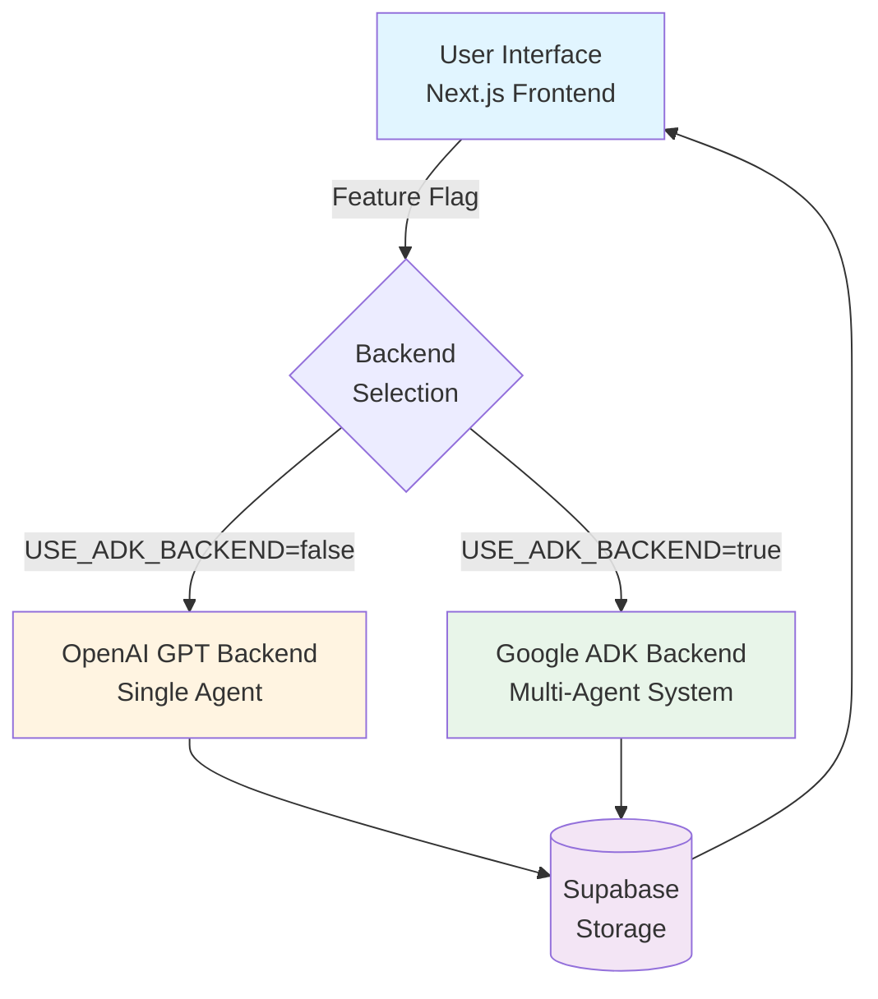
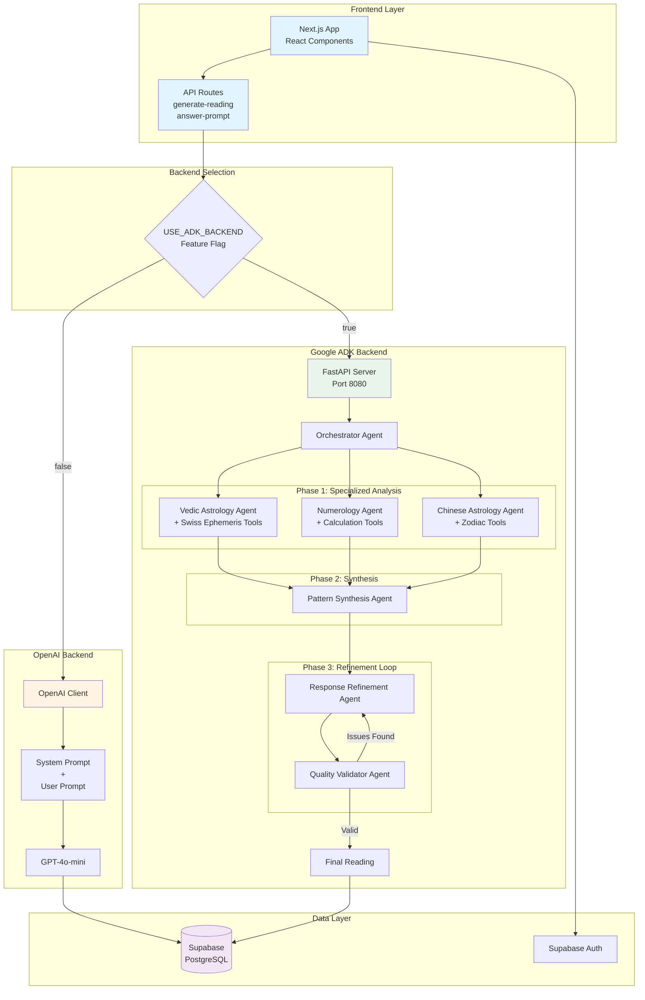
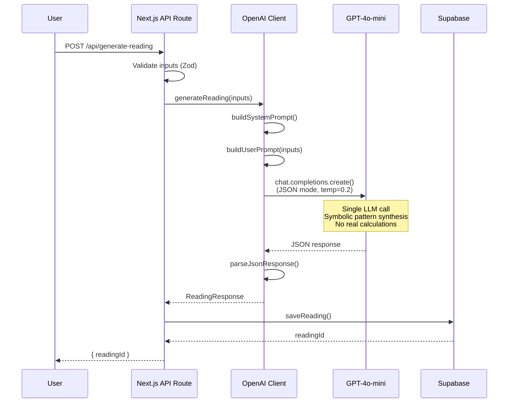
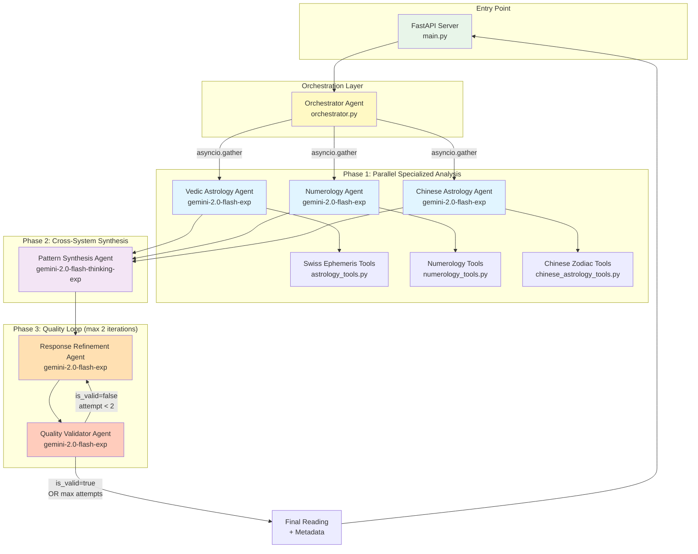
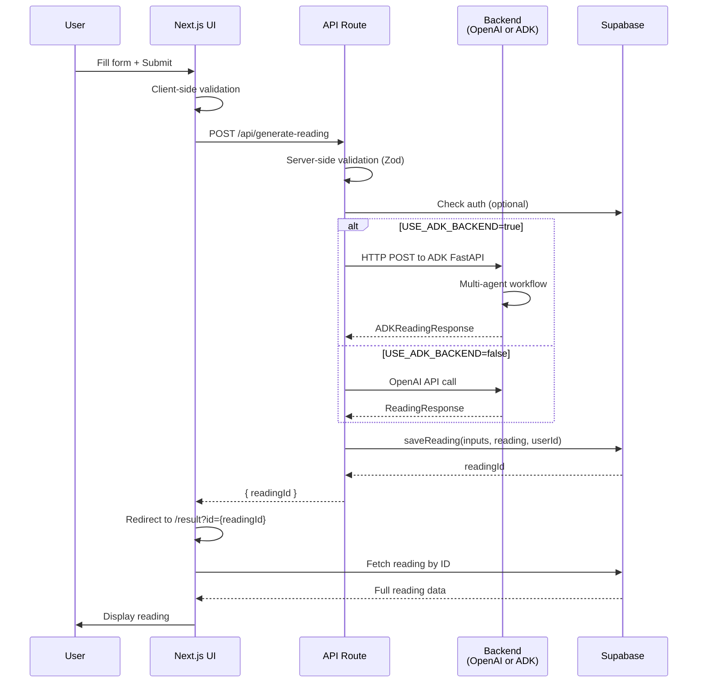
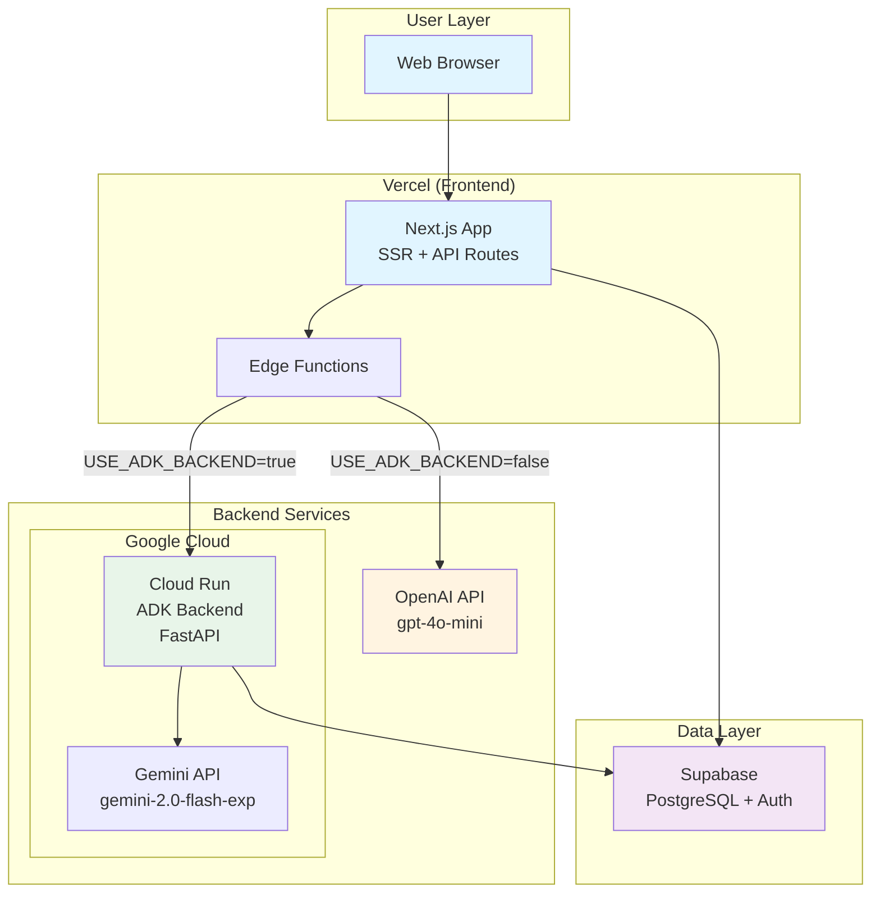
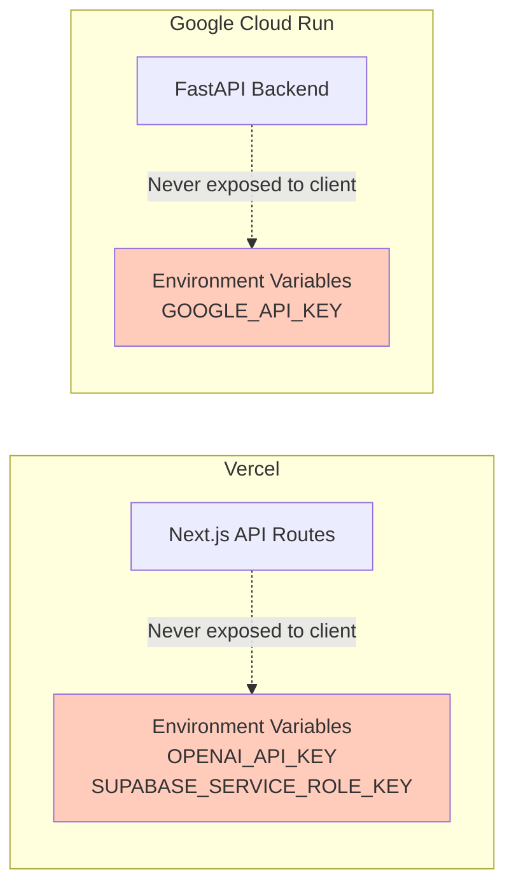
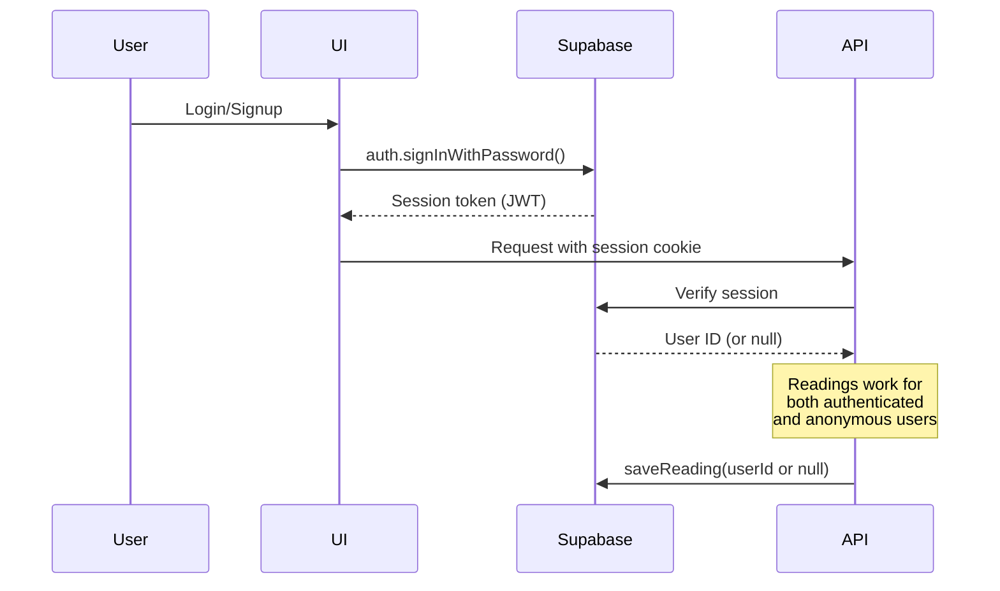

# Pellucid Insights - System Architecture

This document provides a comprehensive overview of the Pellucid Insights system architecture, covering both backend implementations: **OpenAI GPT** (single-agent) and **Google ADK** (multi-agent deep reasoning).

---

## Table of Contents

1. [System Overview](#system-overview)
2. [Architecture Comparison](#architecture-comparison)
3. [OpenAI GPT Architecture](#openai-gpt-architecture)
4. [Google ADK Deep Agent Architecture](#google-adk-deep-agent-architecture)
5. [Frontend Integration](#frontend-integration)
6. [Data Flow](#data-flow)
7. [Deployment Architecture](#deployment-architecture)
8. [Technology Stack](#technology-stack)

---

## System Overview

Pellucid Insights is a personalized astrological insights platform that generates reflective readings by synthesizing patterns from multiple divination systems (Vedic astrology, numerology, and Chinese astrology). The system supports **two distinct backend architectures** that can be switched via feature flags:



### Key Differentiators

| Aspect | OpenAI GPT | Google ADK |
|--------|-----------|------------|
| **Complexity** | Single LLM call | 6 specialized agents with orchestration |
| **Reasoning Depth** | Generic pattern synthesis | Deep multi-system cross-analysis |
| **Latency** | ~2-3 seconds | ~8-12 seconds |
| **Cost per Reading** | ~$0.0003 | ~$0.009-0.017 (optimized) |
| **Quality Assurance** | None | Validation + refinement loop |
| **Calculations** | None (symbolic only) | Real birth charts, numerology, zodiac |

---

## Architecture Comparison

### High-Level Architecture Diagram



---

## OpenAI GPT Architecture

### Design Philosophy

The OpenAI backend uses a **single-agent, prompt-engineered approach** optimized for:
- **Speed**: Minimal latency (~2-3 seconds)
- **Cost efficiency**: ~$0.0003 per reading
- **Simplicity**: No external dependencies or complex orchestration

### Architecture Diagram



### Components

#### 1. **System Prompt** ([`lib/openai.ts`](file:///d:/Python_practice/Pellucid/pellucid-insights/lib/openai.ts#L62-L174))

A carefully crafted prompt that:
- Defines the AI's role as a "reflection and pattern-synthesis tool"
- Establishes hard rules (no predictions, no certainty, no advice)
- Specifies tone (simple, calm, grounded)
- Enforces strict JSON output schema

**Key Principles:**
```
✓ Pattern recognition across systems
✓ Speak in probabilities and observations
✓ Normalize user's experience
✓ Reduce self-blame
✓ Keep interpretations open-ended
```

#### 2. **User Prompt Builder** ([`lib/openai.ts`](file:///d:/Python_practice/Pellucid/pellucid-insights/lib/openai.ts#L179-L206))

Constructs personalized prompts with:
- User's name, birth date, birth time (optional)
- Birth city (for light contextual references)
- Focus area (optional, e.g., "career", "relationships")

#### 3. **JSON Response Parser** ([`lib/openai.ts`](file:///d:/Python_practice/Pellucid/pellucid-insights/lib/openai.ts#L38-L57))

Defensive parsing that:
- Strips markdown code fences
- Validates JSON structure
- Returns typed `ReadingResponse`

### Output Schema

```typescript
{
  headline: string;           // 6-12 words
  coreTheme: string;          // 2-3 sentences with empathy
  strengths: string[];        // Exactly 3 items, ≤12 words each
  watchOuts: string[];        // Exactly 2 items, ≤12 words each
  next7Days: string[];        // Exactly 3 focus areas, verb-led, ≤10 words
  journalPrompt: string;      // One reflective question
  disclaimer: string;         // Reminder this is a lens, not truth
}
```

### Strengths

✅ **Fast**: 2-3 second response time  
✅ **Cost-effective**: $0.0003 per reading  
✅ **Simple deployment**: No separate backend service  
✅ **Reliable**: Single point of failure, easy to debug  

### Limitations

⚠️ **No real calculations**: Symbolic interpretations only  
⚠️ **Generic insights**: Limited depth compared to multi-agent analysis  
⚠️ **No quality loop**: No validation or refinement mechanism  

---

## Google ADK Deep Agent Architecture

### Design Philosophy

The Google ADK backend implements a **multi-agent deep reasoning system** optimized for:
- **Depth**: Real calculations + multi-system cross-analysis
- **Quality**: Validation and refinement loops
- **Scalability**: Parallel agent execution
- **Transparency**: Structured workflow with clear phases

### Architecture Diagram



### Detailed Workflow

#### **Phase 1: Specialized Analysis (Parallel Execution)**

Three agents run **concurrently** using `asyncio.gather()`:

##### 1. **Vedic Astrology Agent**
- **Model**: `gemini-2.0-flash-exp`
- **Tools**: Swiss Ephemeris calculations
  - Birth chart generation
  - Planetary positions (Sun, Moon, Ascendant)
  - Dasha periods (planetary cycles)
  - House placements
- **Output**: Structured analysis of planetary influences

##### 2. **Numerology Agent**
- **Model**: `gemini-2.0-flash-exp`
- **Tools**: Numerology calculations
  - Life Path Number
  - Expression Number
  - Soul Urge Number
  - Personality Number
- **Output**: Numeric pattern analysis

##### 3. **Chinese Astrology Agent**
- **Model**: `gemini-2.0-flash-exp`
- **Tools**: Chinese zodiac calculations
  - Zodiac animal (based on birth year)
  - Element (Wood, Fire, Earth, Metal, Water)
  - Yin/Yang polarity
- **Output**: Chinese zodiac interpretation

**Code Reference**: [`agents/specialized_agents.py`](file:///d:/Python_practice/Pellucid/adk-backend/agents/specialized_agents.py)

#### **Phase 2: Pattern Synthesis**

##### **Pattern Synthesis Agent**
- **Model**: `gemini-2.0-flash-thinking-exp` (extended reasoning)
- **Input**: Results from all 3 specialized agents
- **Task**: 
  - Identify **convergent themes** (patterns that appear across multiple systems)
  - Highlight **contrasts** (where systems diverge)
  - Surface **overlapping tendencies**
- **Output**: Unified synthesis with cross-system insights

**Code Reference**: [`agents/specialized_agents.py#L228-L280`](file:///d:/Python_practice/Pellucid/adk-backend/agents/specialized_agents.py)

#### **Phase 3: Refinement Loop (Max 2 Iterations)**

##### **Response Refinement Agent**
- **Model**: `gemini-2.0-flash-exp`
- **Input**: Synthesis result
- **Task**: Transform synthesis into Pellucid's output format
  - Grounded, calm tone
  - Simple language
  - Empathetic framing
  - Strict JSON schema compliance
- **Output**: Refined reading

##### **Quality Validator Agent**
- **Model**: `gemini-2.0-flash-exp`
- **Input**: Refined reading
- **Validation Checks**:
  - ✓ No predictions or certainty language
  - ✓ No advice or instructions
  - ✓ Appropriate tone (calm, grounded)
  - ✓ JSON schema compliance
  - ✓ Empathy and normalization present
- **Output**: `{ is_valid: boolean, issues: string[] }`

**Loop Logic**:
```python
for attempt in range(max_refinement_attempts):
    refined_result = await run_refinement(synthesis_result, user_data)
    validation_result = await run_validation(refined_result)
    
    if validation_result.get("is_valid", True):
        break  # Success!
    else:
        # Re-refine with feedback (if attempts remain)
```

**Code Reference**: [`agents/orchestrator.py#L95-L118`](file:///d:/Python_practice/Pellucid/adk-backend/agents/orchestrator.py)

### Agent Configuration

Each agent is configured with:

```python
{
    "model": "gemini-2.0-flash-exp",  # or gemini-2.0-flash-thinking-exp
    "config": {
        "temperature": 0.3,           # Low for consistency
        "max_output_tokens": 1000,    # Varies by agent
        "system_instruction": "...",  # Agent-specific prompt
    },
    "tools": [...]                    # Agent-specific tools
}
```

### Tools Implementation

#### **Vedic Astrology Tools** ([`tools/astrology_tools.py`](file:///d:/Python_practice/Pellucid/adk-backend/tools/astrology_tools.py))

Uses **Swiss Ephemeris** library for astronomical calculations:

```python
@tool
def calculate_birth_chart(
    birth_date: str,
    birth_time: str,
    latitude: float,
    longitude: float
) -> dict:
    """
    Calculate Vedic birth chart with planetary positions
    """
    # Real astronomical calculations
    # Returns: Sun sign, Moon sign, Ascendant, houses, dashas
```

#### **Numerology Tools** ([`tools/numerology_tools.py`](file:///d:/Python_practice/Pellucid/adk-backend/tools/numerology_tools.py))

Pythagoras-based numerology calculations:

```python
@tool
def numerology_profile_tool(
    full_name: str,
    birth_date: str
) -> dict:
    """
    Calculate complete numerology profile
    """
    # Returns: Life Path, Expression, Soul Urge, Personality numbers
```

#### **Chinese Astrology Tools** ([`tools/chinese_astrology_tools.py`](file:///d:/Python_practice/Pellucid/adk-backend/tools/chinese_astrology_tools.py))

Chinese zodiac and element calculations:

```python
@tool
def chinese_astrology_tool(birth_date: str) -> dict:
    """
    Determine Chinese zodiac sign and element
    """
    # Returns: Zodiac animal, element, yin/yang
```

### Strengths

✅ **Deep analysis**: Real calculations, not symbolic  
✅ **Quality assurance**: Validation + refinement loop  
✅ **Transparency**: Clear multi-phase workflow  
✅ **Scalability**: Parallel agent execution  
✅ **Rich insights**: Cross-system pattern synthesis  

### Trade-offs

⚠️ **Higher latency**: 8-12 seconds (vs 2-3 for OpenAI)  
⚠️ **Higher cost**: $0.009-0.017 per reading (vs $0.0003)  
⚠️ **Complexity**: Requires separate backend service  
⚠️ **Dependencies**: Swiss Ephemeris, FastAPI, etc.  

---

## Frontend Integration

### Feature Flag System

The Next.js frontend uses **environment variables** to switch backends:

```typescript
// In .env.local
USE_ADK_BACKEND=true              // or false
ADK_BACKEND_URL=http://localhost:8080  // or Cloud Run URL
```

### API Route Implementation

**File**: [`app/api/generate-reading/route.ts`](file:///d:/Python_practice/Pellucid/pellucid-insights/app/api/generate-reading/route.ts)

```typescript
const USE_ADK_BACKEND = process.env.USE_ADK_BACKEND === "true";

export async function POST(request: NextRequest) {
  // 1. Validate inputs (Zod schema)
  const inputs = UserInputSchema.parse(body);
  
  // 2. Route to appropriate backend
  let reading;
  if (USE_ADK_BACKEND) {
    reading = await generateReadingWithADK(inputs);  // Google ADK
  } else {
    reading = await generateReading(inputs);         // OpenAI
  }
  
  // 3. Save to Supabase
  const readingId = await saveReading(inputs, reading, user?.id);
  
  return NextResponse.json({ readingId });
}
```

### Client Libraries

#### **OpenAI Client** ([`lib/openai.ts`](file:///d:/Python_practice/Pellucid/pellucid-insights/lib/openai.ts))

```typescript
export async function generateReading(inputs: UserInput): Promise<ReadingResponse> {
  const openai = getOpenAIClient();
  const completion = await openai.chat.completions.create({
    model: "gpt-4o-mini",
    messages: [
      { role: "system", content: buildSystemPrompt() },
      { role: "user", content: buildUserPrompt(inputs) }
    ],
    temperature: 0.2,
    response_format: { type: "json_object" }
  });
  return parseJsonResponse(completion.choices[0].message.content);
}
```

#### **ADK Client** ([`lib/adk-client.ts`](file:///d:/Python_practice/Pellucid/pellucid-insights/lib/adk-client.ts))

```typescript
export async function generateReadingWithADK(
  request: ADKReadingRequest
): Promise<ADKReadingResponse> {
  const response = await fetch(`${ADK_BACKEND_URL}/api/adk/generate-reading`, {
    method: "POST",
    headers: { "Content-Type": "application/json" },
    body: JSON.stringify(request)
  });
  
  if (!response.ok) {
    throw new Error(`ADK Backend error: ${response.statusText}`);
  }
  
  return await response.json();
}
```

---

## Data Flow

### Complete Request Flow



### Data Models

#### **User Input**
```typescript
{
  name: string;
  birthDate: string;      // YYYY-MM-DD
  birthTime?: string;     // HH:mm (optional)
  birthCity: string;
  focusArea?: string;     // Optional focus area
}
```

#### **Reading Response** (Both Backends)
```typescript
{
  headline: string;
  coreTheme: string;
  strengths: string[];    // Length: 3
  watchOuts: string[];    // Length: 2
  next7Days: string[];    // Length: 3
  journalPrompt: string;
  disclaimer: string;
  _metadata?: {           // ADK only
    systems_analyzed: string[];
    model_used: string;
    workflow: string;
  }
}
```

#### **Supabase Storage**
```sql
CREATE TABLE readings (
  id UUID PRIMARY KEY,
  user_id UUID REFERENCES auth.users,  -- NULL for anonymous
  name TEXT,
  birth_date DATE,
  birth_time TIME,
  birth_city TEXT,
  focus_area TEXT,
  reading JSONB,                        -- ReadingResponse
  created_at TIMESTAMPTZ DEFAULT NOW()
);
```

---

## Deployment Architecture

### Production Deployment Diagram



### Deployment Configuration

#### **Frontend (Vercel)**

```bash
# Environment Variables
OPENAI_API_KEY=sk-...
USE_ADK_BACKEND=true
ADK_BACKEND_URL=https://pellucid-adk-backend-xyz.run.app

NEXT_PUBLIC_SUPABASE_URL=https://xyz.supabase.co
NEXT_PUBLIC_SUPABASE_ANON_KEY=eyJ...
SUPABASE_SERVICE_ROLE_KEY=eyJ...
```

#### **ADK Backend (Google Cloud Run)**

```bash
# Deploy command
cd adk-backend
gcloud builds submit --config cloudbuild.yaml

# Environment Variables (Cloud Run)
GOOGLE_API_KEY=AIza...
ENVIRONMENT=production
ENABLE_CACHING=true
```

**Dockerfile**: [`adk-backend/Dockerfile`](file:///d:/Python_practice/Pellucid/adk-backend/Dockerfile)

```dockerfile
FROM python:3.11-slim
WORKDIR /app
COPY requirements.txt .
RUN pip install --no-cache-dir -r requirements.txt
COPY . .
CMD ["uvicorn", "main:app", "--host", "0.0.0.0", "--port", "8080"]
```

---

## Technology Stack

### Frontend

| Technology | Purpose | Version |
|------------|---------|---------|
| **Next.js** | React framework (SSR + API routes) | 14.x |
| **React** | UI library | 18.x |
| **TypeScript** | Type safety | 5.x |
| **Tailwind CSS** | Styling | 3.x |
| **Zod** | Schema validation | 3.x |
| **Supabase JS** | Database + Auth client | 2.x |

### Backend - OpenAI

| Technology | Purpose | Version |
|------------|---------|---------|
| **OpenAI SDK** | GPT API client | 4.x |
| **GPT-4o-mini** | Language model | Latest |

### Backend - Google ADK

| Technology | Purpose | Version |
|------------|---------|---------|
| **FastAPI** | Web framework | 0.115+ |
| **Google GenAI SDK** | Gemini API client | 0.8+ |
| **Gemini 2.0 Flash** | Language model (most agents) | Latest |
| **Gemini 2.0 Flash Thinking** | Extended reasoning (synthesis) | Latest |
| **Swiss Ephemeris** | Astronomical calculations | pyswisseph 2.10+ |
| **Uvicorn** | ASGI server | 0.30+ |
| **Pydantic** | Data validation | 2.x |

### Data & Infrastructure

| Technology | Purpose |
|------------|---------|
| **Supabase** | PostgreSQL database + Auth |
| **Vercel** | Frontend hosting |
| **Google Cloud Run** | ADK backend hosting |
| **Google Cloud Build** | CI/CD for ADK backend |

---

## Cost Analysis

### Per-Reading Cost Breakdown

#### **OpenAI Backend**

| Component | Cost |
|-----------|------|
| GPT-4o-mini API call | ~$0.0003 |
| **Total** | **~$0.0003** |

**Monthly estimate** (1,000 readings): **~$0.30**

#### **Google ADK Backend**

| Component | Calls | Cost per Call | Subtotal |
|-----------|-------|---------------|----------|
| Vedic Agent | 1 | $0.001 | $0.001 |
| Numerology Agent | 1 | $0.001 | $0.001 |
| Chinese Agent | 1 | $0.001 | $0.001 |
| Synthesis Agent (Thinking) | 1 | $0.003 | $0.003 |
| Refinement Agent | 1-2 | $0.001 | $0.001-0.002 |
| Validator Agent | 1-2 | $0.001 | $0.001-0.002 |
| **Total** | | | **$0.009-0.017** |

**Monthly estimate** (1,000 readings): **~$9-17**

> **Note**: Google offers 1,000 free Gemini API requests/day, which covers development and low-volume production use.

---

## Performance Characteristics

### Latency Comparison

```mermaid
gantt
    title Reading Generation Latency
    dateFormat X
    axisFormat %Ls
    
    section OpenAI
    API Call + Response    :0, 2000
    Parse & Save          :2000, 500
    
    section Google ADK
    Phase 1 (Parallel)    :0, 4000
    Phase 2 (Synthesis)   :4000, 3000
    Phase 3 (Refinement)  :7000, 3000
    Validation            :10000, 1000
    Parse & Save          :11000, 500
```



### Scalability

#### **OpenAI Backend**
- ✅ **Horizontal scaling**: Vercel Edge Functions auto-scale
- ✅ **No state**: Stateless API calls
- ⚠️ **Rate limits**: OpenAI API limits (10,000 RPM for Tier 2)

#### **Google ADK Backend**
- ✅ **Horizontal scaling**: Cloud Run auto-scales containers
- ✅ **Parallel execution**: Phase 1 agents run concurrently
- ⚠️ **Cold starts**: ~2-3 seconds for Cloud Run cold start
- ⚠️ **Rate limits**: Gemini API limits (1,000 RPD free tier)

---

## Security Considerations

### API Key Management



### Authentication Flow



### Data Privacy

- ✅ **Anonymous readings**: Users can generate readings without authentication
- ✅ **User-owned data**: Authenticated users can view their reading history
- ✅ **No PII in logs**: Birth data not logged in production
- ✅ **HTTPS only**: All API calls encrypted in transit

---

## Monitoring & Observability

### Logging Strategy

#### **Frontend (Vercel)**
```typescript
console.log('[API] Received generate-reading request');
console.log(`[API] User authenticated: ${!!user}`);
console.log(`[API] Starting ${backendName} generation...`);
```

#### **ADK Backend (Cloud Run)**
```python
print("🔮 Phase 1: Running specialized agents in parallel...")
print("✅ Specialized agents completed")
print("🧩 Phase 2: Synthesizing cross-system patterns...")
print("✨ Phase 3: Refining response...")
print("🔍 Phase 4: Validating quality...")
```

### Metrics to Monitor

| Metric | OpenAI | ADK | Tool |
|--------|--------|-----|------|
| **Latency (p50, p95, p99)** | ✓ | ✓ | Vercel Analytics, Cloud Run Metrics |
| **Error rate** | ✓ | ✓ | Vercel Logs, Cloud Run Logs |
| **API cost** | ✓ | ✓ | OpenAI Dashboard, Google Cloud Billing |
| **Validation failures** | N/A | ✓ | Cloud Run Logs |
| **Cold start frequency** | N/A | ✓ | Cloud Run Metrics |

---

## Future Enhancements

### Potential Improvements

1. **Caching Layer**
   - Cache birth chart calculations (deterministic)
   - Redis or Cloud Memorystore
   - Reduce ADK latency by ~30%

2. **A/B Testing Framework**
   - Randomly assign users to OpenAI vs ADK
   - Track user satisfaction metrics
   - Data-driven backend selection

3. **Streaming Responses**
   - Stream ADK agent outputs in real-time
   - Improve perceived latency
   - Use Server-Sent Events (SSE)

4. **Agent Specialization**
   - Add Tarot agent
   - Add I Ching agent
   - Expand synthesis to 5+ systems

5. **Personalization**
   - Learn from user feedback
   - Adjust tone based on preferences
   - Store user-specific context

---

## Conclusion

Pellucid Insights demonstrates a **dual-architecture approach** that balances:

- **Speed vs Depth**: OpenAI for fast responses, ADK for rich analysis
- **Cost vs Quality**: OpenAI for budget-conscious, ADK for premium
- **Simplicity vs Sophistication**: Single-agent vs multi-agent orchestration

The **feature flag system** enables seamless switching between backends, allowing for:
- **Development flexibility**: Test both approaches locally
- **Production experimentation**: A/B test with real users
- **Graceful degradation**: Fallback to OpenAI if ADK is unavailable

This architecture serves as a **reference implementation** for building AI systems that prioritize **user agency, transparency, and quality** over hype and mysticism.

---

## Quick Reference

### Start Development (OpenAI)
```bash
cd pellucid-insights
npm run dev
# Uses OpenAI by default
```

### Start Development (ADK)
```bash
# Terminal 1: ADK Backend
cd adk-backend
venv\Scripts\activate  # Windows
uvicorn main:app --reload --port 8080

# Terminal 2: Next.js Frontend
cd pellucid-insights
# Set USE_ADK_BACKEND=true in .env.local
npm run dev
```

### Deploy ADK Backend
```bash
cd adk-backend
gcloud builds submit --config cloudbuild.yaml
```

### Switch Backends in Production
```bash
# Vercel Dashboard → Environment Variables
USE_ADK_BACKEND=true  # or false
ADK_BACKEND_URL=https://your-cloud-run-url.run.app
```

---

**Last Updated**: January 2026  
**Maintainer**: Pellucid Insights Team
