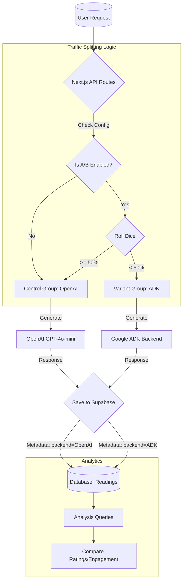

# A/B Testing Strategy: OpenAI vs. ADK Agents

## 1. Objective
To determine which intelligence backend produces "better" astrological readings, defined by:
- Higher user engagement (time spent, completion rate).
- More positive direct feedback (star ratings).
- Higher perceived accuracy ("Hit" vs "Miss" on specific sections).

## 2. Methodology: Traffic Splitting
We will implement a randomized traffic split at the API level (`/api/generate-reading`).

- **Control Group (A)**: OpenAI GPT-4o-mini (Single Agent)
- **Variant Group (B)**: Google ADK (Multi-Agent System: Vedic, Chinese, Numerology)

### Traffic Allocation
- **Initial Phase**: 10% ADK / 90% OpenAI (Safety Check)
- **Testing Phase**: 50% ADK / 50% OpenAI (Data Gathering)

### User Consistency
To ensure a consistent experience, we will stick a user to a specific backend if they regenerate a reading, or we can treat each *new* reading as an independent trial.
*Recommendation*: Treat each *reading generation* as an independent trial for simpler implementation, but log the `backend_used` per reading.

## 3. Implementation Plan

### A. Environment Configuration
Add these variables to `.env.local` and Vercel:
```email
ENABLE_AB_TESTING=true
ADK_TRAFFIC_PERCENTAGE=50  # 0 to 100
```

### B. Backend Logic (`app/api/generate-reading/route.ts`)
Modify the POST handler to select the backend:
```typescript
const shouldUseADK = () => {
  if (!process.env.ENABLE_AB_TESTING) return false;
  const roll = Math.random() * 100;
  return roll < Number(process.env.ADK_TRAFFIC_PERCENTAGE);
};
```

### C. Data Tracking (`lib/storage.ts`)
We must tag every reading with its source.
1. Add `backend_used` column to `readings` table (or use `metadata` JSONB).
2. When saving a reading, record "OpenAI" or "ADK".
3. Pass this tag to analytics events.

## 4. Key Metrics & Success Criteria

We will measure success using the following metrics throughout the user journey:

| Metric | Definition | Success Signal |
| :--- | :--- | :--- |
| **Star Rating** | Average 1-5 star rating on the feedback widget. | ADK > OpenAI (Statistically Significant) |
| **"Hit" Rate** | % of section feedback marked as "Hit" or "Useful". | ADK has higher % of "Hits". |
| **Feedback Vol.** | % of users who bother to leave text feedback. | Higher volume often means stronger emotion (positive or negative). |
| **Journal Engagement** | % of users who ask a follow-up journal question. | Higher rate = deeper trust/intrigue. |

## 5. Analytics & Reporting

We will use Supabase SQL queries to analyze the results.

### Example Query: Average Rating by Backend
```sql
SELECT
  r.metadata->>'backend_used' as backend,
  AVG(f.rating) as avg_rating,
  COUNT(f.id) as feedback_count
FROM feedback f
JOIN readings r ON f.reading_id = r.id
GROUP BY 1;
```

### Example Query: "Hit" Rate by Backend
```sql
SELECT
  r.metadata->>'backend_used' as backend,
  sf.section_name,
  COUNT(*) FILTER (WHERE sf.reaction = 'hit') as hits,
  COUNT(*) as total_reactions
FROM section_feedback sf
JOIN readings r ON sf.reading_id = r.id
GROUP BY 1, 2;
```

## 6. Execution Timeline

1.  **Deployment**: Deploy ADK backend to Cloud Run/Render.
2.  **Instrumentation**: Update Next.js to log `backend_used`.
3.  **Sanity Check**: Run 10% traffic to ADK for 24 hours. Monitor error rates.
4.  **Full Test**: Scale to 50% traffic. Run for N=100 readings per group.
5.  **Analysis**: Run SQL queries to determine the winner.
6.  **Switch**: Deprecate the loser or iterate on the ADK agents if closer but distinct.

## 7. Architecture Diagram

This diagram illustrates the flow of A/B testing logic within the application.


