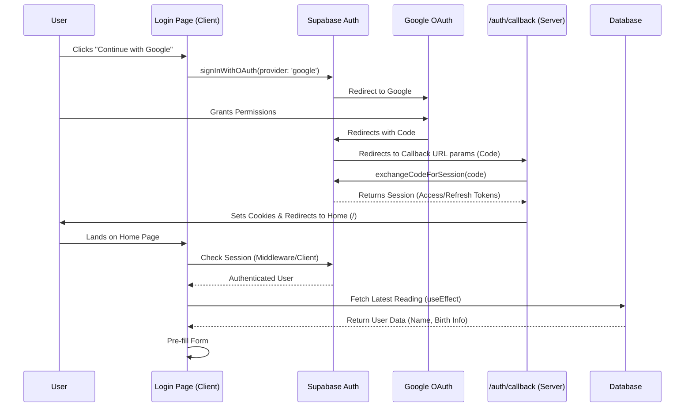
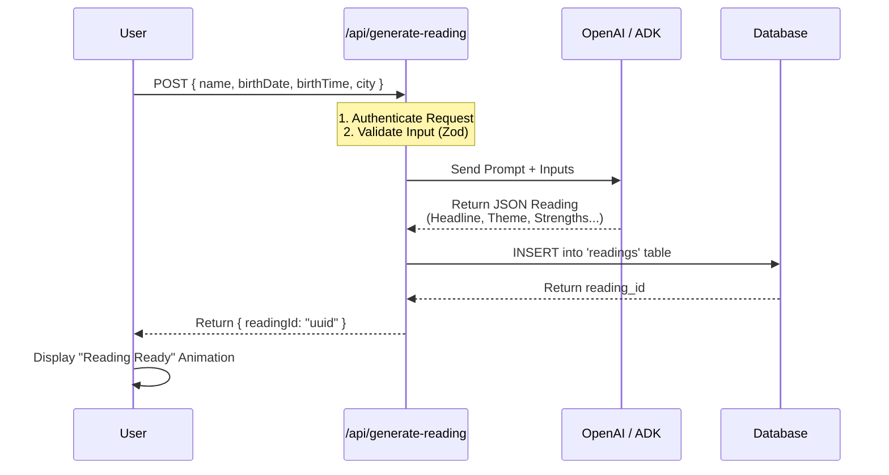
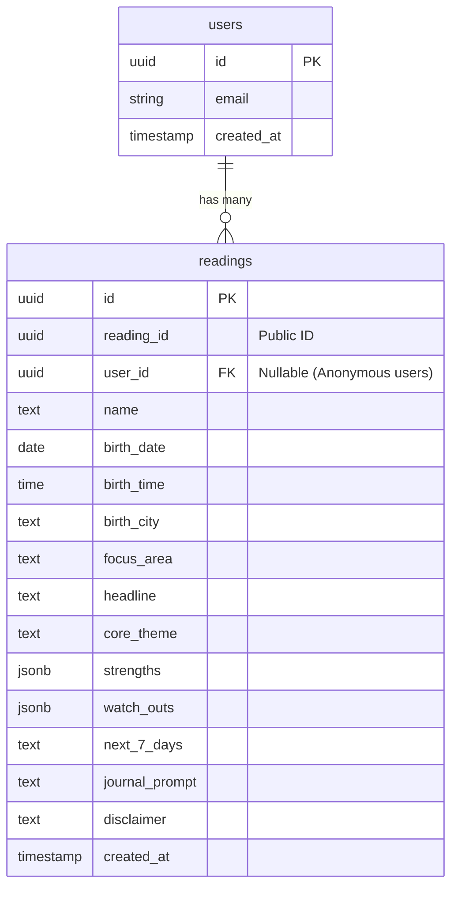
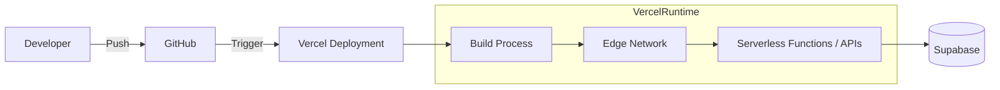

# Pellucid Insights - System Architecture

This document outlines the high-level architecture, data flows, and database schema for Pellucid Insights, a web application that generates personalized insights using AI.

## 1. High-Level Architecture

The application is built on **Next.js 14**, utilizing **Supabase** for backend services (Auth & Database) and **OpenAI/ADK** for intelligence generation.

```mermaid
graph TD
    User[User Device]
    subgraph Frontend [Next.js Client]
        Landing[Landing Page / App]
        AuthUI[Auth Pages (Login/Signup)]
    end
    
    subgraph Backend [Next.js API Routes]
        GenAPI[POST /api/generate-reading]
        PromptAPI[POST /api/answer-prompt]
        FeedbackAPI[POST /api/feedback]
    end
    
    subgraph Services
        SupabaseAuth[Supabase Auth]
        SupabaseDB[(Supabase Database)]
        OpenAI[OpenAI / ADK LLM]
    end

    User --> Landing
    User --> AuthUI
    
    AuthUI -->|OAuth/Email| SupabaseAuth
    Landing -->|Fetch Profile| SupabaseDB
    
    Landing -->|Submit Form| GenAPI
    GenAPI -->|Generate| OpenAI
    GenAPI -->|Save Result| SupabaseDB
    
    Landing -->|Journaling| PromptAPI
    PromptAPI -->|Refine/Answer| OpenAI
```

## 2. Authentication Flow (Google OAuth)

This sequence diagram details the login process, specifically how the application handles Google OAuth, callbacks, and session persistence across Localhost and Production.



## 3. Reading Generation Workflow

The core feature of the app is generating etheric insights based on user input.



## 4. Data Model

The application primarily relies on the `readings` table to store user inputs and generated content.



## 5. Deployment Architecture (Vercel)



This architecture ensures scalability, secure authentication, and a separation of concerns between the client-side presentation and server-side intelligence generation.
